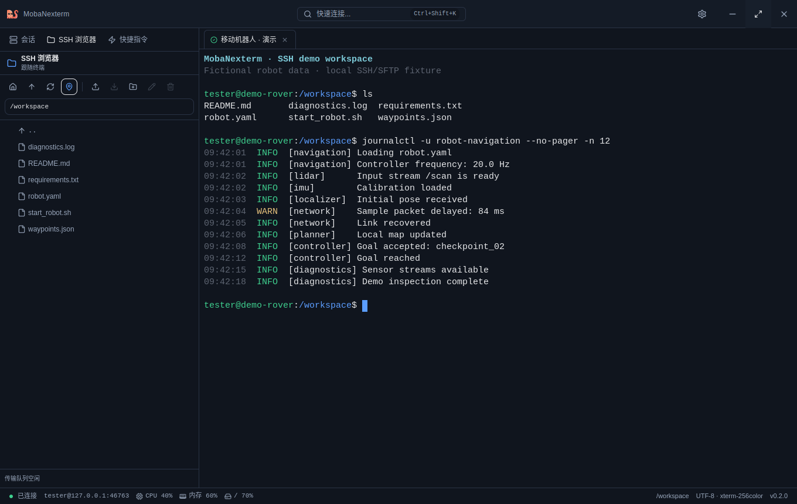
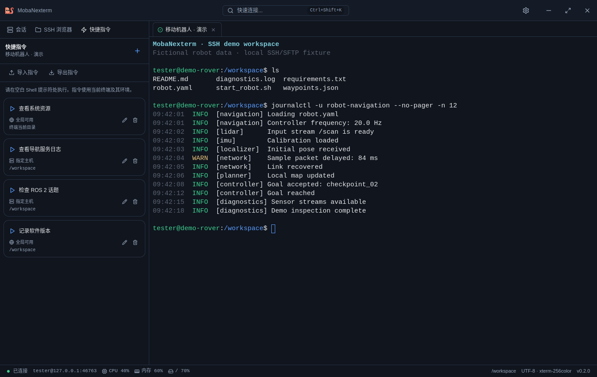
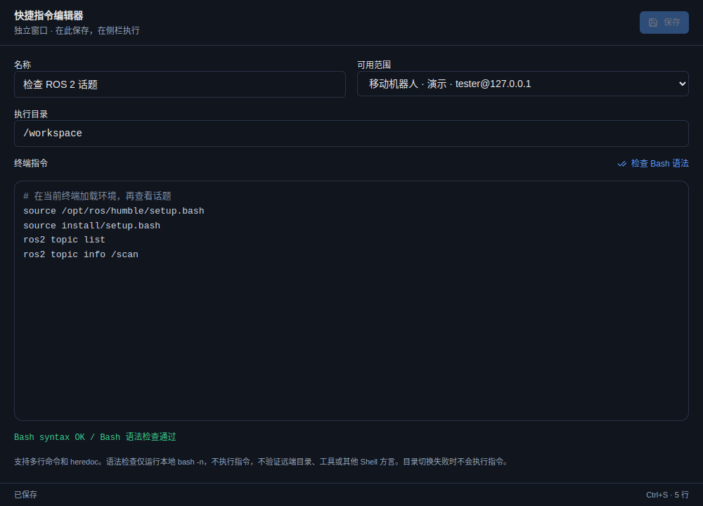
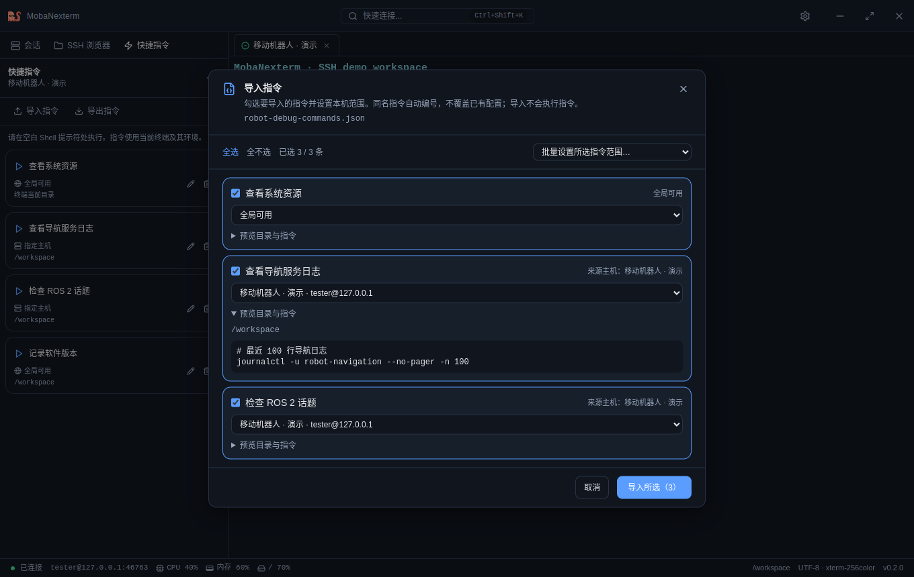
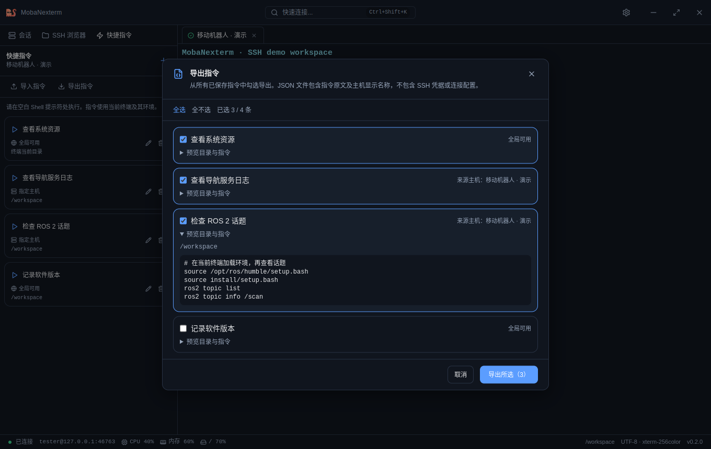
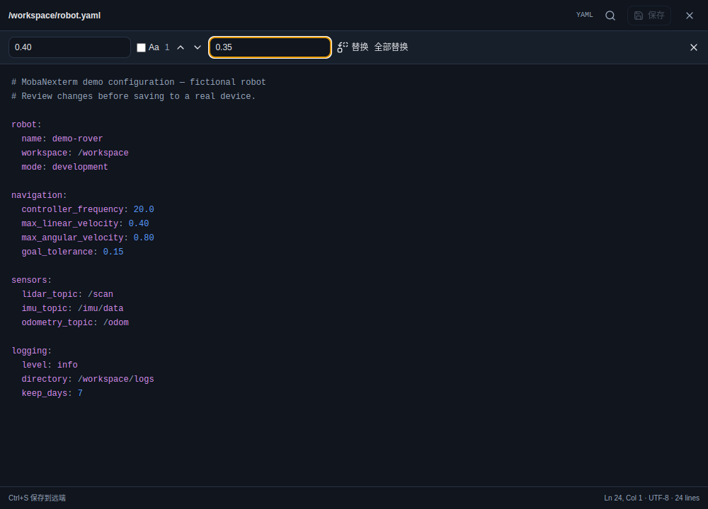
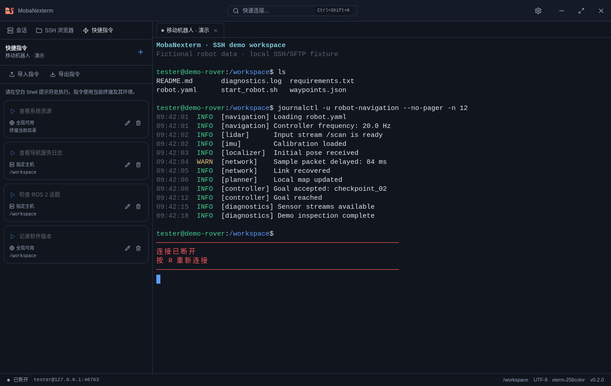

<p align="right">
  <strong>简体中文</strong> | <a href="./README_EN.md">English</a>
</p>

# MobaNexterm

**面向 Linux 的 SSH 调试工作台：终端、远程文件、性能摘要与可分享的快捷指令。**

MobaNexterm 参考 MobaXterm 的一体化工作方式，将日常 SSH 操作集中在一个桌面窗口中。连接开发板、调试机器人、查看服务日志、修改远程配置时，可以在终端与文件之间直接切换，并把反复使用的命令保存下来，与其他人分享。

基于 Electron、React、TypeScript、xterm.js 和 ssh2 构建，采用 MIT 协议，当前处于积极开发阶段。

[快速开始](#快速开始) · [功能亮点](#功能亮点) · [安装](#安装) · [开发与测试](#开发与测试) · [路线图](doc/engineering/PLAN.md)



> 截图来自实际应用，使用隔离的本地 SSH/SFTP 演示服务。主机、文件、日志及性能数值均为示例，不包含真实设备信息。机器人与 ROS 命令用于演示自定义工作流，并非内置 ROS 诊断功能。

## 功能亮点

| 日常工作 | MobaNexterm 提供的支持 |
| --- | --- |
| 同时连接多台设备 | 保存 SSH 会话、按名称/主机/用户筛选、多标签终端、密码或私钥认证 |
| 边运行边查看文件 | SFTP 目录跟随终端，当前目录及展开目录约每 3 秒自动刷新 |
| 随时了解设备负载 | 底栏显示当前主机的 CPU、内存、根分区占用，正常每 5 秒采样 |
| 少敲重复命令 | 自定义工作目录和多行脚本；全局可用或仅对指定主机会话可用 |
| 分享调试经验 | 勾选导出/导入 JSON 指令配置，预览脚本并映射本机主机 |
| 修改远端配置 | 独立编辑窗口、基础语法高亮、搜索替换、保存冲突检查 |
| 断线后继续排查 | 断连提示写入终端，历史输出仍可查看、搜索和复制，按 `R` 重连 |

### 终端与文件浏览器一起工作

在终端中切换目录，左侧文件浏览器可随之更新。终端或其他程序新建、删除文件后，列表会自动刷新；手动浏览其他目录时，也可以暂停跟随。

- 支持文件和目录上传、下载，以及从本地文件管理器拖拽上传。
- 支持新建目录、重命名、删除、权限修改、复制路径与归档下载。
- Bash/Zsh 目录集成默认开启；已保存的关闭设置会保留，修改设置后需重连。服务器原生 OSC 7 目录报告也可使用。
- Shell 与 SFTP 分别处理状态；SFTP 不可用时，SSH 终端仍可继续使用。

终端提供 ANSI 配色、Unicode 11 字宽、5,000 行回滚、链接识别和 `Ctrl+Shift+F` 搜索。窗口尺寸会同步给远端 PTY；持续输出通过流控处理。

### 把常用操作变成快捷指令

左侧“快捷指令”页卡会根据当前激活的 SSH 终端显示适用的按钮。系统资源检查可以全局共享，某台设备的启动脚本或日志命令则可以限定到该主机会话。



每条指令支持名称、执行目录、多行命令和可用范围。执行目录留空时沿用终端当前目录；也可指定绝对路径、`~` 或 `~/…`。目录切换失败时不会执行后续命令。

指令编辑器是**独立、非模态窗口**，编辑时仍可操作终端、复制内容。提供 Shell 高亮、字段校验、手动 Bash 语法检查、`Ctrl+S` 保存和未保存关闭提醒。



指令在当前终端的 Shell 环境中执行，请在空白 Shell 提示符处使用。断连时按钮不可用，Vim 等备用屏幕程序打开时会阻止写入。Bash 语法检查不执行脚本，也不验证远端工具和目录是否存在。

### 选择、预览、分享指令配置

将一组常用调试命令导出，其他人可以只导入需要的部分，再绑定自己的设备。

- **导出**：从所有已保存指令中全选或逐条勾选，查看目录和脚本，保存为 JSON。
- **导入**：读取文件后预览、选择条目；主机专属指令需明确映射到本机 SSH 会话，或改为全局可用，支持批量设置。
- **同名处理**：创建新的本地记录，同名自动编号为 `名称 (2)` 等，不覆盖已有指令。
- **完整校验**：校验格式、版本、字段及目标主机；失败或取消不写入部分配置，导入不会执行指令。



<details>
<summary>查看选择性导出界面</summary>



</details>

每份文件最多 500 条指令、2 MiB。导出文件不包含 SSH 凭据、会话 ID 或连接配置；写在命令中的内容和主机显示名称会保留。格式示例见[快捷指令使用与设计说明](doc/engineering/PERFORMANCE_AND_SHORTCUTS.md#快捷指令导入与导出)。

### 在独立窗口编辑远端文件

双击可编辑的文本文件，打开独立编辑器，无需关闭终端或下载后再手动上传。

- 基础语法高亮、行列位置、搜索、区分大小写、替换与全部替换。
- `Ctrl+F` 查找、`Ctrl+H` 替换、`Ctrl+S` 保存，关闭前提醒未保存修改。
- 保存前检查远端内容是否已被修改；通过同目录临时文件与 OpenSSH 原子重命名扩展完成替换。
- 保存失败时保留本地草稿；服务器不支持安全保存所需能力时明确报错。



支持的文本文件上限为 2 MiB；二进制文件、无效 UTF-8 等不进入文本编辑流程。完整保存边界见[验收记录](doc/engineering/VALIDATION.md)。

### 简洁的桌面体验

底栏性能采样使用独立 SSH 通道，不向正在使用的终端插入监控命令。内存和磁盘指标悬停可查看已用/总量；缺失或失败显示不可用，避免把旧数据当作当前状态。

界面支持深浅主题、中英文、可调侧栏、80%–125% 缩放和 11–20 px 终端字号。独立编辑窗口按主窗口所在屏幕定位，并处理窗口离屏和显示器布局变化。

<details>
<summary>查看断连后的终端：保留上下文，按 R 重连</summary>

断连提示直接追加到终端，使用红色文字与分隔线。断连后仍可回看输出，重新连接也会保留回滚记录。



</details>

## 快速开始

1. 点击“会话”页卡的 `+`，或按 `Ctrl+Shift+K`，填写主机、端口、用户名及认证信息。
2. 双击保存的会话，打开终端。左侧“SSH 浏览器”用于查看和传输文件。
3. 打开“快捷指令”，点击 `+`，填写目录和命令，选择全局或指定主机范围后保存。
4. 在终端的空白 Shell 提示符处点击指令按钮。需要分享时使用“导出指令”，接收配置时使用“导入指令”。

例如，可以将以下内容保存为某台机器人的快捷指令，执行目录设为实际工作空间。请按远端环境修改 ROS 版本、路径及服务名：

```bash
source /opt/ros/humble/setup.bash
source install/setup.bash
ros2 topic list
ros2 topic info /scan
```

| 操作 | 快捷键 |
| --- | --- |
| 新建 SSH 会话 | `Ctrl+Shift+K` |
| 切换终端标签 | `Ctrl+Tab` / `Ctrl+Shift+Tab` |
| 终端搜索 | `Ctrl+Shift+F` |
| 终端复制 / 粘贴 | `Ctrl+Shift+C` / `Ctrl+Shift+V` |
| 编辑器查找 / 替换 | `Ctrl+F` / `Ctrl+H`（远程文件编辑器） |
| 编辑器保存 | `Ctrl+S` |
| 全屏 | `F11` |
| 断连后重新连接 | 在终端按 `R` |

## 安装

需要 Linux 桌面环境及可访问的 SSH 服务器。文件管理需要服务器支持 SFTP；底栏性能采样面向提供 `/proc` 和 `df` 的 Linux 主机。

查看 [Releases](https://github.com/xiaozhangyu250/MobaNexterm/releases) 中的安装包；如尚无适合你系统的预构建版本，可从源码运行。

**Debian / Ubuntu**

下载 `.deb` 后，将文件名替换为实际版本与架构：

```bash
sudo apt install ./MobaNexterm-VERSION-ARCH.deb
```

从应用菜单启动，或运行 `/opt/MobaNexterm/mobanexterm`。卸载使用 `sudo apt remove mobanexterm`。

**AppImage**

```bash
chmod +x MobaNexterm-VERSION-ARCH.AppImage
./MobaNexterm-VERSION-ARCH.AppImage
```

### 从源码运行

需要 Node.js 20 或更高版本、npm 和 Linux 桌面环境。

```bash
git clone https://github.com/xiaozhangyu250/MobaNexterm.git
cd MobaNexterm
npm ci
npm run dev
```

构建并预览生产版本：

```bash
npm run build
npm run preview
```

### 构建 Linux 安装包

```bash
npm run package:linux                         # deb + AppImage，使用 package.json 版本
npm run package:linux -- --targets deb         # 仅构建 deb
npm run package:linux -- --targets AppImage    # 仅构建 AppImage
```

产物位于 `release/`。需要更新版本时使用 `--version X.Y.Z`，该参数会同步修改 `package.json` 与锁文件。仓库也提供 exFAT 等不支持符号链接的文件系统兼容处理，见 `.npmrc` 和 `scripts/setup-bin-shims.cjs`。

## 开发与测试

```bash
npm run check             # 类型检查、lint、单元/服务回归、生产构建
npm run test:electron     # Electron + 隔离 SSH/SFTP 桌面回归
# 无桌面显示的 Linux CI 环境
xvfb-run -a npm run test:electron
```

测试覆盖终端协议与连接生命周期、文件刷新、文本保存、窗口几何、性能采样、快捷指令执行及配置导入导出。桌面测试使用临时用户目录与本机演示服务，不连接用户保存的真实主机。CI 执行检查并保留截图；跨发行版和物理多屏测试范围见[验收记录](doc/engineering/VALIDATION.md)。

重建本页截图：

```bash
npm run docs:screenshots
# 无桌面显示时：xvfb-run -a npm run docs:screenshots
```

该命令构建当前代码并在真实 Electron 界面中准备演示场景，更新 `doc/img/readme-*.png`。不需要远端机器人，不使用个人会话数据。

```text
src/
  main/        Electron 主进程、IPC、SSH/SFTP、指令存储与性能采样
  preload/     跨进程类型化 API
  renderer/    React 界面、状态管理、终端与独立编辑窗口
  shared/      共享类型、校验与配置交换格式
scripts/       开发、打包与 README 截图脚本
tests/unit/    单元与服务回归
tests/electron/ 桌面流程与 SSH/SFTP 测试服务
doc/engineering/ 设计、路线图与验收边界
doc/img/       文档截图
```

技术栈：Electron · React 18 · TypeScript · xterm.js · ssh2 · Zustand · Tailwind CSS · Radix UI · electron-builder。

## 兼容范围与已知限制

- **目录跟随**：依赖 Bash/Zsh 目录集成或远端 OSC 7 报告。文件自动刷新采用轮询，并非服务端文件事件订阅。
- **性能摘要**：显示根分区占用，不汇总所有磁盘。远端禁止 SSH exec、缺少命令或权限不足时，部分指标可能不可用。
- **快捷指令**：执行封装面向 Bash/Zsh/POSIX 兼容 Shell，未验证 fish。普通屏幕交互程序的输入状态无法总是自动识别，请回到空白 Shell 提示符处执行。
- **文本保存**：依赖 OpenSSH `posix-rename` 扩展；不保留扩展 ACL、xattr 或硬链接关系，也不提供跨程序的原子冲突锁。
- **凭据与信任**：可用时通过 Electron `safeStorage` 加密；无法使用时仍有本地明文回退。SSH 主机密钥指纹信任管理尚待完善，具体见[当前验收与限制](doc/engineering/VALIDATION.md)。
- **尚未提供的功能**：Windows/macOS 安装包、会话分组、图形化 SSH Agent、跳板机、端口转发和终端分屏不在当前已实现范围内。

功能路线见 [PLAN.md](doc/engineering/PLAN.md)。欢迎根据实际调试场景提出需求或复现问题。

## 参与贡献

欢迎提交 [Issue](https://github.com/xiaozhangyu250/MobaNexterm/issues) 和 Pull Request。开发约定见 [CONTRIBUTING.md](CONTRIBUTING.md)，安全问题请按 [SECURITY.md](SECURITY.md) 私下报告。反馈中请附版本、系统环境、复现步骤，并去除密码、私钥和真实设备信息。

## 开源协议

[MIT License](LICENSE)
