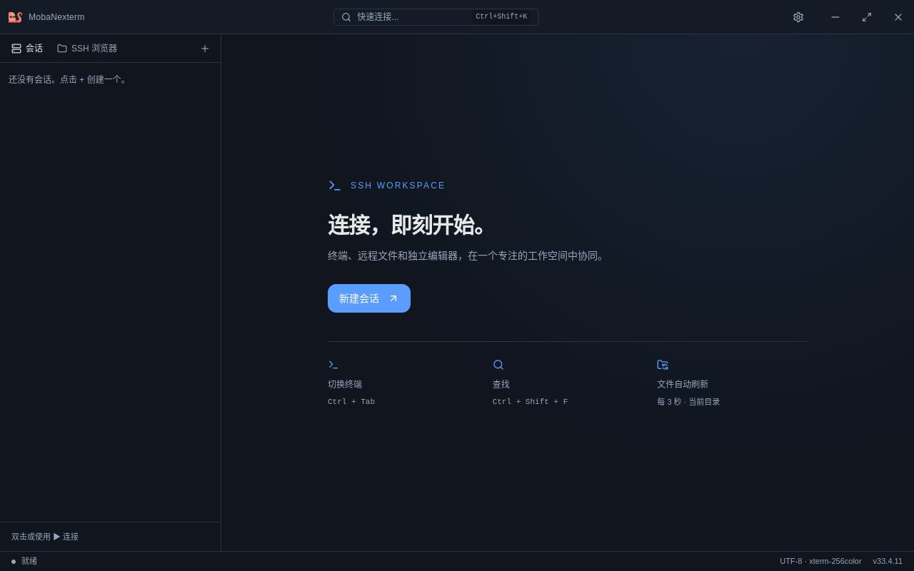
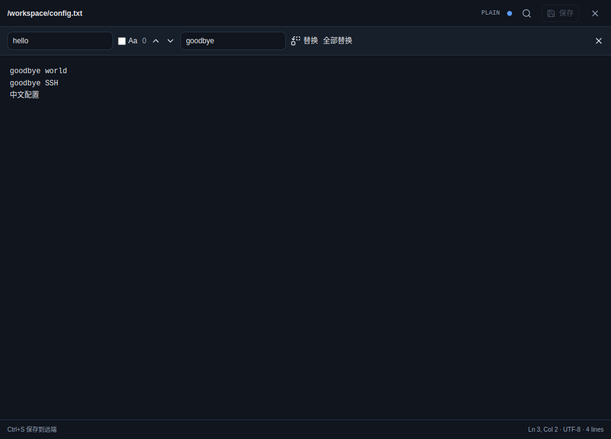

<p align="right">
  <strong>简体中文</strong> | <a href="./README_EN.md">English</a>
</p>

# MobaNexterm

MobaNexterm 是一款面向 Linux 桌面的开源 SSH 终端与 SFTP 文件管理工具。它参考 MobaXterm 的一体化工作方式，将会话管理、远程终端和文件传输整合在同一个轻量、现代的桌面界面中。

项目基于 Electron、React、TypeScript、xterm.js 和 ssh2 构建，目前处于积极开发阶段。

> [!WARNING]
> 文件管理功能会直接操作远程主机。在生产环境中使用上传、覆盖、重命名、修改权限或删除功能前，请确认目标路径并备份重要数据。

## 本轮工作台改造

已加入终端 Unicode 与流控修复、自动文件刷新、可移动的独立远程编辑器（搜索/替换与冲突保护）、终端搜索、会话筛选、可调侧栏和多屏窗口恢复。

- [开发规划与后续功能](doc/engineering/PLAN.md)
- [实现范围、测试命令与人工验收矩阵](doc/engineering/VALIDATION.md)
- `npm run check` 执行完整工程检查；`npm run test:electron` 运行隔离的桌面与 SSH/SFTP 回归测试。
- Bash/Zsh 目录集成默认开启，在连接时安装目录报告钩子；可在“设置 → SSH”关闭，修改后需重连。已保存的关闭设置会保留，文件面板提供启用并重连入口；文件自动刷新独立生效。
- 编辑器安全保存要求服务器支持 OpenSSH 原子重命名；不支持时保留原文件并提示。

## 界面预览





<details>
<summary>查看更多界面截图</summary>

### 终端右键菜单


### SFTP 文件右键菜单


### 连接失败与快速重连


</details>

## 功能

### SSH 会话

- 创建、编辑、保存和删除 SSH 连接
- 支持密码认证和本地私钥认证
- 支持带口令的私钥
- 双击会话或点击连接按钮快速打开终端
- 多标签页同时管理多个远程终端
- 连接断开或失败后按 `R` 快速重连

### 远程终端

- 基于 xterm.js 的交互式终端，支持 `xterm-256color`
- 自动适配窗口尺寸，并同步远程 PTY 行列数
- 5,000 行终端回滚缓冲区
- 自动识别并打开终端中的网页链接
- 右键菜单以及 `Ctrl+Shift+C` / `Ctrl+Shift+V` 复制粘贴
- 标签页实时显示连接中、已连接、已断开和错误状态

### SFTP 文件管理

- 树形浏览远程目录，可手动输入路径
- SFTP 浏览器可自动跟随终端当前目录
- 上传和下载单个文件
- 递归上传、下载整个目录
- 从本地文件管理器拖拽文件或目录进行上传
- 显示文件传输进度和任务状态
- 新建目录、重命名、删除和修改 Unix 权限
- 复制远程文件或目录路径
- 当服务器未启用 SFTP 时，SSH 终端仍可独立使用

### 外观与本地化

- 深色与浅色主题
- 简体中文与英文界面
- `80%` 至 `125%` 界面缩放
- `11px` 至 `20px` 终端字体大小
- 设置自动保存在本地

### 安全与桌面集成

- 在系统支持时，密码和私钥口令通过 Electron `safeStorage` 加密保存
- 渲染进程启用上下文隔离，并关闭 Node.js 集成
- 外部链接交由系统默认浏览器打开
- 单实例运行，避免多个进程同时修改本地会话数据

> [!NOTE]
> 如果当前桌面环境无法提供 Electron `safeStorage` 加密能力，应用会回退到本地明文存储。建议在安装了系统密钥环服务的桌面环境中使用，并妥善保护用户配置目录。

## 快速安装

### 系统要求

- Linux 桌面环境
- 可访问目标服务器的网络
- 目标服务器已启用 SSH；如需文件管理，还需启用 SFTP 子系统

请从项目的 [Releases](https://github.com/mobanexterm/mobanexterm/releases) 页面下载与你的系统架构匹配的安装包。

### Debian / Ubuntu

下载 `.deb` 文件后，在文件所在目录执行：

```bash
sudo apt install ./MobaNexterm-VERSION-ARCH.deb
```

安装完成后，可从应用菜单启动 MobaNexterm，也可以在终端运行：

```bash
/opt/MobaNexterm/mobanexterm
```

卸载：

```bash
sudo apt remove mobanexterm
```

### AppImage

下载 `.AppImage` 文件后执行：

```bash
chmod +x MobaNexterm-VERSION-ARCH.AppImage
./MobaNexterm-VERSION-ARCH.AppImage
```

AppImage 无需安装，可放置在任意有执行权限的目录中运行。

## 快速使用

### 1. 创建 SSH 会话

1. 启动 MobaNexterm。
2. 点击左侧“会话”面板右上角的 `+`，或点击顶部“快速连接”区域。
3. 填写会话名称、主机地址、端口和用户名。
4. 选择密码或私钥认证；使用私钥时填写本机私钥的绝对路径。
5. 点击“创建”保存会话。

### 2. 连接远程主机

双击已保存的会话，或将鼠标移到会话上并点击连接按钮。每次连接会创建一个独立终端标签页，因此可以并行操作多台主机。

连接失败或远程终端关闭后，可在当前终端中按 `R` 重新连接。

### 3. 使用终端

| 操作 | 方式 |
| --- | --- |
| 复制选中内容 | `Ctrl+Shift+C` 或终端右键菜单 |
| 粘贴剪贴板内容 | `Ctrl+Shift+V` 或终端右键菜单 |
| 重新连接 | 连接失败或断开后按 `R` |
| 打开链接 | 点击终端中识别出的 URL |
| 关闭会话 | 点击标签页右侧的关闭按钮 |

### 4. 管理远程文件

连接成功后，打开左侧“SSH 浏览器”：

- 使用顶部工具栏上传、下载、新建目录、重命名或删除文件。
- 将本地文件或目录拖入文件列表，可上传到当前目录；拖到远程目录上可上传到该目录。
- 右键远程文件或目录，可下载、修改权限、复制路径、重命名或删除。
- 开启定位按钮后，文件浏览器会尽可能跟随终端当前工作目录。
- 面板底部会显示上传和下载任务的进度与结果。

## 从源码运行

### 开发环境

- Node.js 20 或更高版本
- npm
- Linux 桌面环境

```bash
git clone https://github.com/mobanexterm/mobanexterm.git
cd mobanexterm
npm ci
npm run dev
```

构建并预览生产版本：

```bash
npm run build
npm run preview
```

## 构建 Linux 安装包

默认同时构建 Debian 安装包和 AppImage：

```bash
npm run package:linux -- --version 0.1.0
```

构建产物会写入 `release/`。也可以只构建指定格式：

```bash
npm run package:linux -- --version 0.1.0 --targets deb
npm run package:linux -- --version 0.1.0 --targets AppImage
```

本地快速迭代时可跳过打包前的类型检查：

```bash
npm run package:linux -- --skip-checks
```

## 开发检查

提交代码前建议运行：

```bash
npm run typecheck
npm run lint
npm test
npm run build
```

## 技术栈

- Electron
- React 18
- TypeScript
- xterm.js
- ssh2
- Zustand
- Tailwind CSS
- Radix UI
- electron-builder

## 项目结构

```text
src/
  main/       Electron 主进程、IPC、SSH/SFTP 服务与凭据存储
  preload/    向渲染进程暴露的类型安全 API
  renderer/   React 用户界面、状态管理与终端组件
  shared/     跨进程共享的类型和常量
scripts/      开发启动、依赖处理和 Linux 打包脚本
tests/        单元测试
doc/img/      文档截图
```

## 文件系统兼容性

仓库包含 `.npmrc` 和 `scripts/setup-bin-shims.cjs`，用于兼容 exFAT 等不支持符号链接的文件系统。在常规 Linux 文件系统上无需额外配置。

## 当前范围

当前版本专注于 Linux 上的 SSH 终端和 SFTP 工作流。Windows/macOS 安装包、会话分组、SSH Agent 图形配置、跳板机、端口转发尚未作为稳定功能提供。独立远程文本编辑器已提供，其兼容范围见验收文档。

## 参与贡献

欢迎提交 Issue 和 Pull Request。开始开发前请阅读 [CONTRIBUTING.md](CONTRIBUTING.md)。

请勿在公开 Issue 中提交密码、私钥、真实主机信息或其他敏感数据。安全问题请按照 [SECURITY.md](SECURITY.md) 私下报告。

## 开源协议

本项目基于 [MIT License](LICENSE) 开源。
